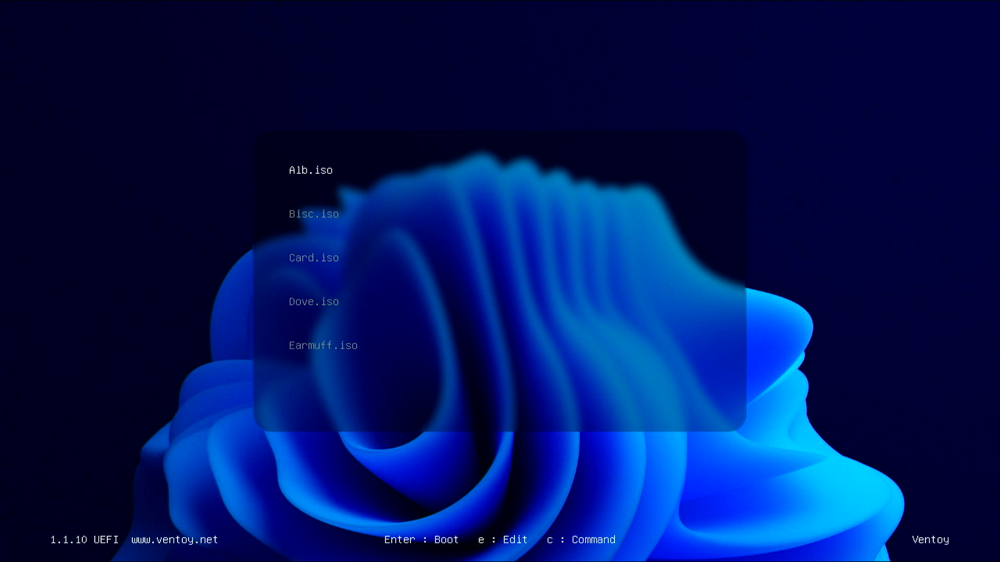
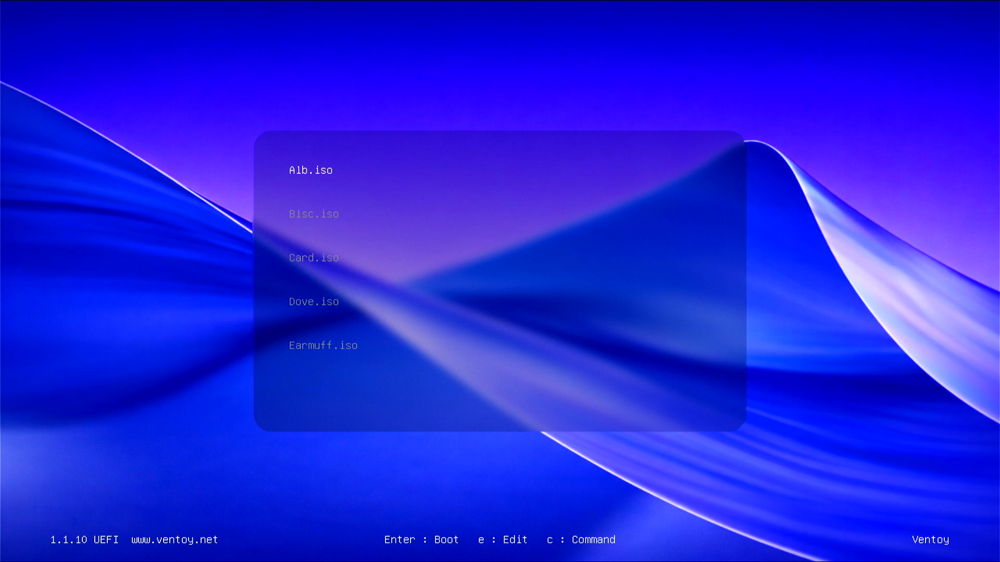
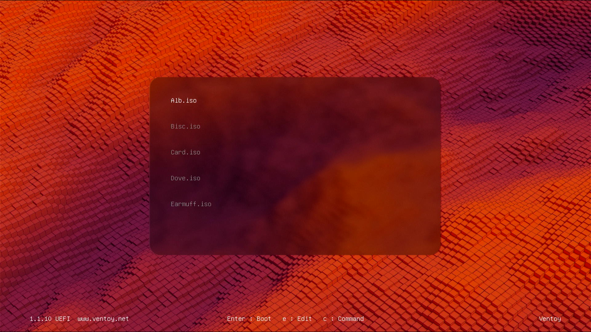
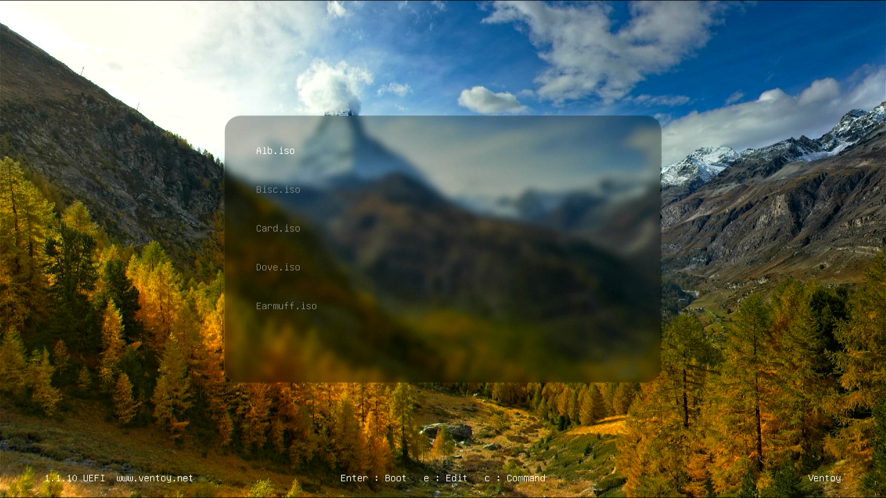
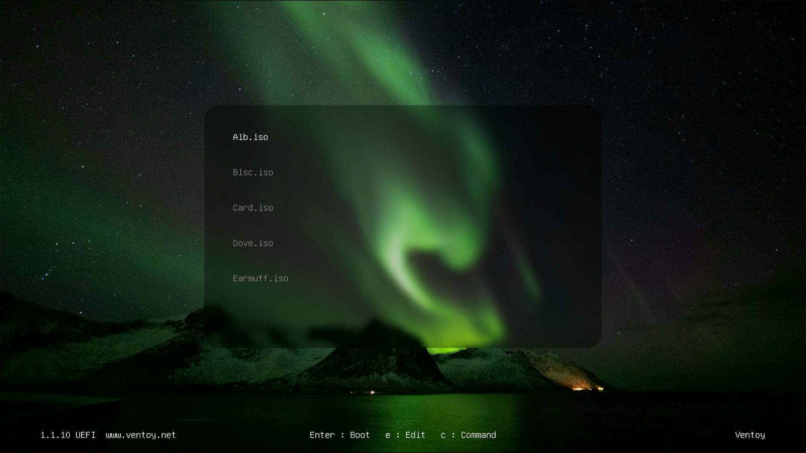

# Ventoy Custom Themes

Ventoy用のカスタムテーマコレクション  
Custom theme collection for Ventoy

## 📦 テーマリスト / Theme List

このリポジトリには、以下のVentoy用テーマが含まれます。  
各テーマは複数の解像度(1280×720, 1920×1080)に対応しています。

This repository contains the following themes for Ventoy.  
Each theme supports multiple resolutions (1280×720, 1920×1080).

## 📸 スクリーンショット / Screenshots

### Moden-11

### Moden-26

### Ubuntu-25.04-A (Atlantic Wave)

### Ubuntu-25.04-B (Autumn)

### Ubuntu-25.04-C (Northern Lights)

## インストール方法 / Installation

1. VentoyをインストールしたUSBに、`/ventoy/theme/`となるようにフォルダを作成する
2. `Ventoy_theme.zip`を解凍し、`/ventoy/theme/`に配置する
3. 使用したいテーマのフォルダから、`ventoy.json`を取り出し、`/ventoy/`に配置する

---

1. Create a `/ventoy/theme/` folder on your Ventoy USB drive
2. Extract `Ventoy_theme.zip` and place it in `/ventoy/theme/`
3. Copy `ventoy.json` from your chosen theme folder to `/ventoy/`

## ライセンス / License

ライセンス情報は各テーマの`credits.txt`を参照してください。

Please refer to `credits.txt` in each theme folder for license information.
